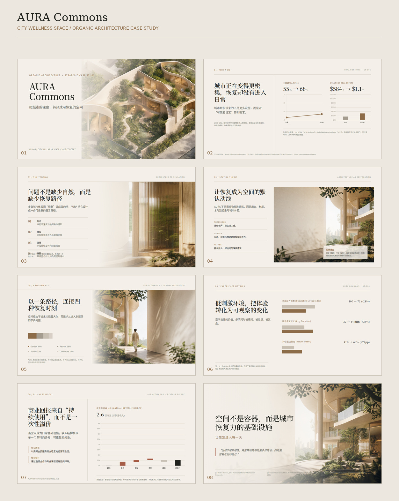
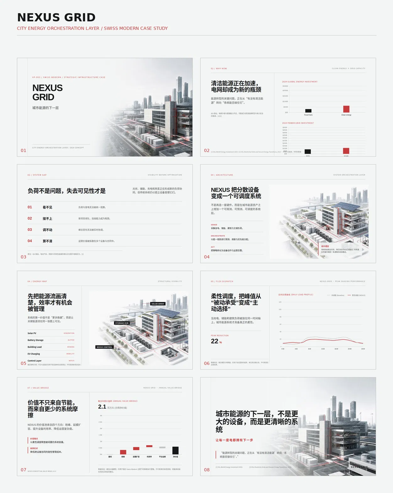
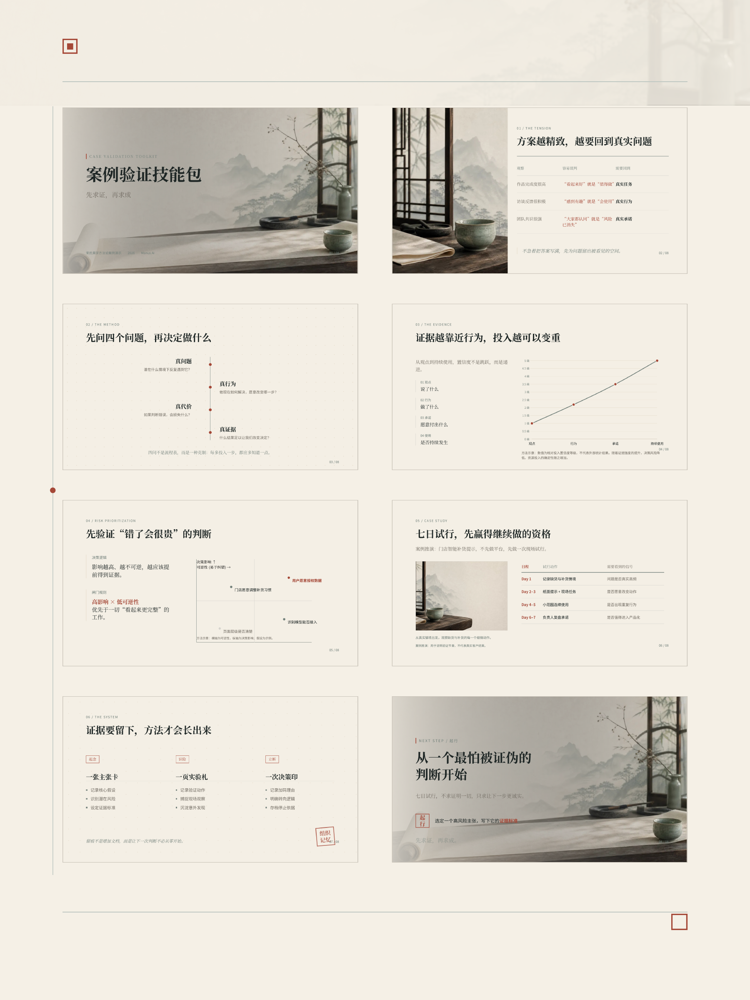

# PPT Visual Art Director OS

> 一个面向高端商业演示的视觉艺术指导、信息设计与原生可编辑 PPTX 生产技能包。

## 项目定位

`ppt-visual-art-director-os` 不是普通的模板集合，也不是只负责绘制页面的脚本。它把内容理解、商业叙事、视觉策略、空间构图、编辑设计、数据表达、媒体治理和确定性质量检查组织成一条可执行的演示生产链。

它的核心原则是：先明确观众需要理解、相信或决定什么，再决定这件事应该如何被看见。高级感来自精准、克制、秩序、空间与细节，而不是更多装饰。每个元素都必须服务于信息理解、情绪表达、品牌价值或阅读体验；无法说明功能的元素应删除。

本项目适合战略汇报、董事会材料、商业提案、品牌发布、数据叙事、管理层报告、研究结论和高端主题演示等场景。它强调**商业逻辑优先、视觉空间统一、数据表达诚实、生产对象可编辑、发布结果可验证**。

## 核心能力

| 能力 | 说明 |
|---|---|
| 内容到视觉策略 | 将受众、决策、张力、证据和行动转化为 Strategy、Direction 与 Story Map |
| 页面级叙事 | 为每页定义单一 insight、narrative role、focus、reading order、energy、density 和 continuity token |
| 视觉空间设计 | 统一背景、媒体、文字、图表、材质、光线、版心、网格和安全区 |
| 信息与数据设计 | 选择诚实的图表关系，保留单位、期间、比较口径、来源和数据状态 |
| 原生可编辑输出 | 使用 `python-pptx` 生成可编辑文字、形状、图片和图表对象 |
| 确定性治理 | 通过 Guard、Compile、Render Evidence、QA 和 Art Critic 形成发布判断 |
| 最小修正 | 优先采用删除、简化、恢复空间、重构重心，再考虑媒体和装饰微调 |

## 设计标准

项目吸收高端产品发布、顶级咨询报告、专业财经媒体、编辑设计和品牌发布中的可观察行为，但不复制任何机构或品牌模板。引用风格只能帮助理解设计行为，不能替代内容判断。

### 高级感的最小判定

一页完成后，按以下顺序检查：

1. 单一结论是否一眼可见。
2. 标题、核心信息、辅助信息和视觉焦点是否清楚分层。
3. 留白是否承担了阅读、节奏或情绪功能。
4. 背景、媒体、文字和图表是否属于同一个视觉空间。
5. 对齐、间距、边界、图文比例和色彩比例是否自然。
6. 删除某个装饰后，信息表达是否变差；如果没有变差，就删除该装饰。

禁止使用堆叠卡片、无意义渐变、复杂特效、廉价科技符号或随机图片来制造高级感。审美优化不得覆盖事实完整性、数据准确性、可读性或生产契约。

## 静态案例

以下案例图片用于展示本技能包的视觉方向、空间品质与版式参考。它们是静态参考资产，不是固定模板；使用时仍应根据内容、受众、品牌和数据关系重新构图。

| 案例一 | 案例二 |
|---|---|
|  |  |

| 案例三 | 案例四 |
|---|---|
|  |  |

案例图片的版权、字体、商标与再分发边界应以用户提供的授权为准；本项目许可证不自动扩展至这些外部资产。

## 目录结构

```text
ppt-visual-art-director-os/
├── SKILL.md
├── LICENSE.txt
├── README.md
├── requirements.txt
├── assets/
│   ├── 1c2f20c6a78cd5c41dd344397e986f5b.png
│   ├── af927d8d95970a43eaec3f6cc67102aa.png
│   ├── bb423798bd14650761b3e744dfcd9905.png
│   └── ffb347873654bd8176db4d7acbb3bd3d.png
├── references/
│   ├── design-intelligence.md
│   ├── design-system.md
│   ├── evidence-library.md
│   ├── production-contract.md
│   └── themes.md
├── scripts/
│   ├── art_critic.py
│   ├── asset_prompt.py
│   ├── charts.py
│   ├── compiler.py
│   ├── elements.py
│   ├── guard.py
│   ├── primitives.py
│   ├── qa.py
│   ├── render_check.py
│   ├── route.py
│   └── selftest.py
└── templates/
    └── strategy_direction.yml
```

## 推荐工作流

### 1. 冻结输入

先记录受众、观看场景、目标决定、页数、交付格式、品牌限制、事实来源、时间、单位、比较口径和不确定性。不可验证的事实必须标记为 `unknown`，不得静默补全。

### 2. 建立 Strategy 与 Direction

将 `claim`、`evidence`、`implication` 和 `action` 分开。然后定义 `visual_world`、`composition_grammar`、`type_voice`、`color_behavior`、`media_role`、`background_scene`、`motion_posture` 和 `forbidden_signals`，使整套 deck 共享同一视觉人格和空间假设。

### 3. 编排 Story Map 与 Page Intent

先安排 `opening → context → problem → insight → evidence → solution → proof → vision → closing` 的叙事阶段，再定义每页的 insight、narrative role、focus、reading order、energy、density、empty space role、page family、rhythm stage 和 continuity token。每页只保留一个可复述结论。

### 4. 生成运行时 spec

主题、页面、背景、图表、来源、文本和叠加层进入统一 spec。所有可见元素必须具有数值 `x`、`y`、`width`、`height`。文字元素必须使用 `text` 字段，字号、颜色、字重、行高、内边距等样式属性放在元素顶层；禁止使用未消费的 `content` 或嵌套 `style`。

一个最小文字元素示例：

```python
{
    "type": "text",
    "id": "headline",
    "x": 48,
    "y": 48,
    "width": 720,
    "height": 80,
    "text": "单一、可复述的页面结论",
    "size": 32,
    "color": "text",
    "bold": True,
    "line_height": 1.15,
    "max_lines": 2,
    "padding": 0,
}
```

### 5. 执行生产链

生产链固定为：

```text
Guard → Compile → Render Evidence → Deterministic QA → Art Critic → Revision
```

优先使用 `qa.py` 的完整入口。仅在需要解释某一失败域时调用单独脚本。修改后先重跑受影响页面，发布前再重跑全 deck。

## 运行方式

### 安装依赖

建议使用虚拟环境：

```bash
python3 -m venv .venv
. .venv/bin/activate
python3 -m pip install -r requirements.txt
```

### 先分路，再预检（默认入口）

不确定该用多大复杂度时，让决策层按内容分类，而不是先假设「最高质量」：

```bash
python3 scripts/route.py path/to/brief.yml --json      # 内容 → 路径 / 页面家族 / 密度 / 资产预算
python3 scripts/guard.py path/to/build_mydeck.py --preflight   # 静态预检（0.2s 级，无需渲染）
```

`route.py` 只接受 `content_type / design_direction / quality_level`，返回该页的家族、密度、能量、字阶、图像决策与派生方向（背景、材质、光线、图表风格、动效、构图语法）；数据、表格、流程、结构页在闸门上直接判为「不出图」。`guard.py --preflight` 用与 Art Critic 同一组常量提前点名确定性硬门槛，返回 `slide / code / observation / minimal_fix`，因此一轮修改从「渲染 4 秒」压缩到「静态 0.2 秒」。

### 编译 PPTX

`compiler.py` 接受一个定义 `build_spec()` 或顶层 `SPEC` 的 Python 模块：

```bash
python3 scripts/compiler.py path/to/build_mydeck.py output.pptx
```

### 运行静态 Guard

```bash
python3 scripts/guard.py path/to/build_mydeck.py --json
```

### 运行完整 QA

```bash
python3 scripts/qa.py path/to/build_mydeck.py output.pptx --json       # 发布口径：dpi 96 + 全量渲染证据
python3 scripts/qa.py path/to/build_mydeck.py output.pptx --quick       # Level 1：静态判定，不渲染
python3 scripts/qa.py path/to/build_mydeck.py output.pptx --key-pages   # Level 2：只渲染关键页
python3 scripts/qa.py path/to/build_mydeck.py output.pptx --fast        # 便宜的全量渲染：dpi 72 + 预检闸门
python3 scripts/qa.py path/to/build_mydeck.py output.pptx --preflight   # 只列可执行修正项
python3 scripts/qa.py path/to/build_mydeck.py output.pptx --manifest    # 追加 Critic + Release Manifest
```

渐进层级只改变「测了多少」，不改变「放宽什么」：Level 1/2 的状态上限是 `REVISE`/`PREVIEW_ONLY`，`release_eligible=False`；`qa["performance"]` 与 `qa["render"]["coverage"]` 记录每轮实际测了什么。

渲染阶段内部并行最多 2 个 worker（按 CPU 收敛，页数 <4 自动关闭），并把 poppler 转换与像素测量串成一条流水。渲染侧另有两层复用：pptx 逐字节未变就复用上一轮 PDF（省掉 1.7s 的 soffice 整份转换），「会被编译成像素的那部分 spec」没变就连 `compile_deck` 一起跳过；两层都做内容核验，`--no-cache` 既不查也不写。12 页真实 deck 实测：Level 3 冷跑 4.7s，同输入重跑 0.0s，Level 2 收口后补齐全量 2.57s → 0.82s，只改 `density`/`insight`/`focus` 标签的一轮 4.8s → 0.01s；冷热两条路径的像素质标逐位一致。

`--fast` / `--preflight` 不改变任何判定阈值，只改变采样密度与批评轮次；当静态预检已能确定渲染必然不是 `PASS` 时，跳过渲染（`performance.render_skipped`）并直接给出 `next_action`。每次运行都返回 `performance`（`guard_ms / compile_ms / render_ms / preflight_items`），使「省掉的轮次」可核对。

渲染证据（Render Evidence）需要系统级依赖：LibreOffice（`soffice`）将 PPTX 转 PDF，`poppler-utils`（`pdftoppm`）将 PDF 转 PNG。缺少任一项时 `run_qa` 自动降级：不阻塞静态治理，但状态只能是 `PREVIEW_ONLY`，不能发布。`--no-render` 仅用于快速迭代布局，同样不代表发布通过。

具体参数和稳定 API 以 `references/production-contract.md` 为准。脚本不会替调用方自动缩字号、改色、重排、删除内容、伪造数据或替换图片。

### 运行自检

```bash
python3 scripts/selftest.py
```

自检覆盖目录结构、引用完整性（含脚本注释）、模块导入、填充契约、Art Critic 基础返回结构与硬门槛、PASS 可达性回归、渲染锚点解析与主题 Accent 测量，以及一次真实编译两页 mini deck 的 Guard → Compile → QA → Release Manifest 端到端冒烟。发布前仍应对真实 deck 执行完整 Guard、Render Evidence 和 QA。

## 质量与发布门

Deterministic QA 只判断可编译、可渲染、可读、可编辑、无越界、无失真和满足硬约束；Art Critic 独立判断层级、平衡、对齐、对比、节奏、一致性、情绪影响、记忆点和专业完成度。技术分数不能代替设计质量。Art Critic v2 采用证据驱动加减分（基准 3/5，凭可观察证据加减，全部写入 `dimension_evidence`），修复了旧版满分封顶导致 PASS 不可达的缺陷，并按失败码表输出硬门槛（`INTENT_UNCLEAR`、`FOCUS_COMPETING`、`CARD_WALL`、`MEDIA_UNJUSTIFIED`、`RHYTHM_FLAT`、`CRITIC_LOW`）。评分体系与调参口径见 `references/scoring.md`。

以下问题属于发布阻断项：关键文字不可读、文字溢出、未声明遮挡、来源区冲突、事实或数据不完整、图表失真、编译失败、资产侵入安全区以及真实渲染证据缺失。状态只允许为 `PASS`、`REVISE`、`BLOCKED` 或 `PREVIEW_ONLY`。

## 失败码与文字契约

文字元素缺少 `text` 时，Guard 返回 `TEXT_FIELD_MISSING`；使用 `content` 时返回 `TEXT_FIELD_INVALID`；使用嵌套 `style` 时返回 `TEXT_STYLE_INVALID`。编译层同步提供明确提示，避免文本框创建成功但文字内容静默为空。

## 设计边界

本项目不提供品牌资产授权、不替用户核验第三方图片、字体、数据或商标许可，也不把风格参考名称当作可复制模板。使用者必须自行确认输入材料、外部资产和依赖的适用授权。

本项目不会访问用户的外部账户，不会替调用方提交、发布或购买内容。所有输出都应在最终使用前由责任人检查事实、版式、字体、素材、版权和目标软件兼容性。

## 版本与验证状态

当前目录整理为 `ppt-visual-art-director-os`，基于 v9 优化版。v2.3 把「少跑一轮」做实：三处内容核验的复用（按页像素 / 整份 PDF / 编译视图）+ deck 级色彩与图表纪律（色相族预算、强调角距离、脏渐变提示、图表样式漂移）+ 焦点落位的轴线判定。评分链路已升级：Art Critic v2.0（证据驱动加减分、真实失败码、PASS 可达）、Render Evidence v1.1（声明锚点解析、主题 Accent 测量、显著图分布）、QA v1.2（分域扣分明细、可选边缘带检查）。速度与智能层：新增 `route.py` 决策层（内容类型 → 版式/风格/资产/字阶/密度）、Guard 静态预检（与 Critic 阈值同源）、QA 分阶段耗时与渲染跳过、背景层直接叠加合同（不计媒体预算、自动置底并补内容保护层）。既有 `compile_deck / run_qa / critique_deck / release_manifest / check_spec` 的参数与返回结构保持向后兼容。27 项自检全部 PASS（含渐进层级、子集证据对齐、并行上限、按页渲染缓存与内容核验、决策缓存、背景层资格、文字对比与行长门禁、报告自证戳）；实测 12 页真实 deck：预检 0.2s（等价于此前需一轮渲染才能发现的缺陷），Level 1 迭代 0.03s，Level 2 关键页冷测 3.7s／热态 0.0s，Level 3 全量冷测 4.7s，同输入复跑 0.0s，只改声明字段（density／insight／focus）的一轮 0.01s，QA 98.4 / Critic 94.2 / Manifest 全部 PASS，冷热两条路径的像素质标逐位一致。发布门本轮转为可自证：证据缓存按内容指纹核验、背景层免检需要资格、文字对比按渲染像素实测、报告与清单互相核对来源——四类曾经能蒙混通过的路径现在一律 fail closed。

## 许可证

本项目采用 MIT License。许可证仅覆盖本项目代码与文档本身；第三方字体、图片、数据、商标、外部引用和生成资产不当然包含在本项目授权内。详见 [LICENSE.txt](LICENSE.txt)。
